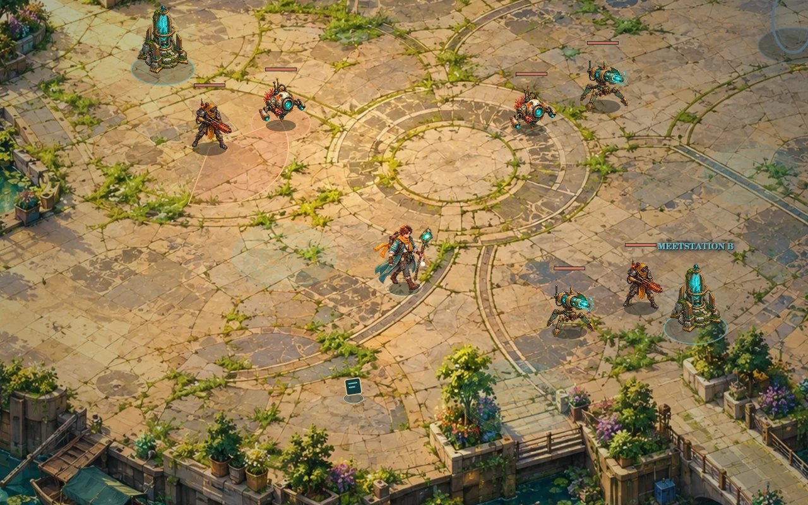

# Gouden Horizon — Aurelia



Een zelfstandig **2.5D action RPG** in een door klimaatontwrichting opgebroken Nederland. Verken tien verbonden gebieden, bouw je eigen veldpak en verbind drie kalibratiekernen met het herstelnet Aurelia.

**Versie 5** voegt veilige handelsposten, zes uitrustingsslots, willekeurige loot met vijf zeldzaamheden, zes nieuwe vijandfamilies, vier gebiedsspreuken en een geanimeerde kernpuls toe. Nieuwe geschilderde portals vervangen de oude doorgangen. Arena’s krijgen hun terugportal pas nadat alle vijanden en kalibratiegolven zijn verslagen. Terugkeren met een kern opent het volgende deel van de wereld; oude gebieden blijven toegankelijk.

## Lokaal spelen

Gebruik Node 18+:

```bash
npm start
```

Open [http://localhost:8080](http://localhost:8080). Er zijn geen npm-dependencies nodig. Gebruik de webserver voor ES-modules en assetverzoeken.

## Besturing

| Invoer | Actie |
| --- | --- |
| WASD / pijlen | Bewegen |
| Muis + links vasthouden | Richten en je vaste hoofdaanval herhalen |
| 1 t/m 6 | Toegewezen vaardigheid direct uitvoeren; vasthouden herhaalt |
| Klik op hotbar-slot | Vaardigheid op een nabij doel of in je huidige richting uitvoeren |
| Q / rechtsklik | Je zelf toegewezen rechter vaardigheid |
| K / klik op level | Skills leren, cijfers en rechtsklik indelen, hoofdaanval kiezen |
| Muiswiel | Hoofdaanval wisselen tussen getij, storm en zon |
| Spatie / E | Ontwijken; twee ladingen, kort onkwetsbaar |
| H | Verband: 45 leven en statusherstel |
| R | Volledig geladen kernpuls |
| F | Handelaar, portal, station, vondst, archief of console gebruiken |
| B / handelsknop | Winkel openen in de veilige zone |
| I | Rugzak, vergelijking en handmatig uitrusten |
| M | Kaart; vrijgespeelde bestemming voor de richtingpijl kiezen |
| Esc | Pauze of een vrijblijvend menu sluiten |
| Touch | Stick om te bewegen; doelknop voor vuur en automatisch richten |

Cijfers en rechtsklik veranderen je hoofdaanval **niet**. Je kunt bijvoorbeeld water op links houden, IJslans op rechts plaatsen en Stormfront op slot 4 uitvoeren.

## Wereld en voortgang

| Kamp / transitroute | Expeditie | Ontgrendeling |
| --- | --- | --- |
| Getijdenkade | Verdronken Ring | Start |
| Getijdenkade | Zonnetuinen met prototypebuit | Eerste kern |
| Verlaten Transportnet | Rode Kilometer | Eerste kern |
| Groene Corridor | Zoutwoud en optionele Zaadkluis | Tweede kern |
| Noordzeebrug | Aurelia-spits | Derde kern |

Transitgebieden hebben een veilige aankomstplek en handelaar. Buiten het kamp liggen routegevaren, vijanden en vondsten. De vier grote arena’s bevatten geen bruikbare of zichtbare reisportal zolang er vijanden leven. In de eerste drie herstel je twee stations, elk met twee golven, en versla je de kernbewaker. Ook achtergebleven vijanden moeten worden verslagen. Dan verschijnt één terugportal. Met F berg je de kern en keer je naar het regionale kamp terug. De laatste Wachter heeft drie fases; na de eindconsole kun je terug naar het handelskamp en verder verkennen.

De kaart verplaatst je niet: gebruik de echte doorgangen met F. Verslagen vijanden, geopende vondsten, winkelvoorraad en voltooide stations blijven bewaard. Oude gebieden kunnen opnieuw bezocht worden; ze genereren geen nieuwe vijanden of gratis buit. Reizen geeft geen gratis leven of mana. Een voltooid station biedt één herstelbeurt.

## Vaardigheden en uitrusting

Elk nieuw level geeft **één punt**. Kies een nieuwe skill of een permanente verbetering, of bewaar het punt. Looptempo, schade, leven, mana en ontwijkherstel zijn build-keuzes.

| Vaardigheid | Werking | Beschikbaar |
| --- | --- | --- |
| Getijdenwaaier | Drie waterbogen; maakt doelen nat | Start |
| Boogbliksem | Directe straal; ketent via natte doelen | Start |
| Zonnebom | Gebogen worp, explosie en kort vuurveld | Start |
| IJslans | Doorboren, vertragen en natte doelen bevriezen | Level 2 |
| Windboemerang | Raakt heen en terug; duwt weg | Level 3 |
| Gletsjerveld | Herhaalde ijsschade en vertraging in een gebied | Level 3 |
| Zwaartekern | Trekt samen en implodeert | Level 4 |
| Cycloon | Bewegend veld dat vijanden samen trekt | Level 4 |
| Stormfront | Herhaaldelijke blikseminslag op een gebied | Level 5 |
| Zonneval | Drie vertraagde gebiedsinslagen; verbrandt en ruimt sporen op | Level 6 |

Nieuwe skills kosten één punt en kunnen in zes cijfer-slots of op rechts/Q worden geplaatst. De standaard rechter vaardigheid volgt je vaste basiselement. Getij → storm geeft +70% schade en kettingbliksem; getij → zon geeft een stoomgolf. De kernpuls bouwt een zichtbare kern op en raakt na een halve seconde meerdere doelen met een brede golf. Deze aanval laadt zichzelf niet op.

Je draagt **focus, mantel, relikwie, laarzen, handschoenen en gordel**. Er zijn 24 buittemplates met willekeurige eigenschappen, itemlevels en vijf zeldzaamheden: **Common, Uncommon, Rare, Epic, Legendary**. Common heeft geen extra eigenschap, Uncommon en Rare één, Epic en Legendary twee. Hogere itemlevels en zeldzaamheden versterken stats. Sommige items vragen een hoger spelerslevel.

Nieuwe items gaan eerst in de rugzak van maximaal 48 onderdelen. Kies het onderdeel, vergelijk het met het passende gedragen slot en klik op **Uitrusten**. Het vorige item blijft in je rugzak. Wisselen behoudt je HP- en mana-percentage. Recyclen en verkopen zijn expliciete, afzonderlijke acties.

## Handel en lootprogressie

Elke handelspost heeft acht blijvende aanbiedingen, met betere itemlevels in latere regio’s. Kopen plaatst een item in de rugzak. Verkopen betaalt 30% van de basisprijs plus een kleine vergoeding voor versterkingen; uitgeruste spullen moeten eerst worden gewisseld. Recyclen geeft minder schroot dan verkopen.

De smid versterkt elk gedragen onderdeel tot **+3**. Een focus krijgt schade, een mantel leven, een relikwie manaherstel, laarzen snelheid, handschoenen kritieke kans en een gordel bescherming. De prijs stijgt per versterking. Verband kost 15 schroot, met maximaal acht ladingen. Handelen kan alleen in een veilige zone.

| Vijand / vondst | Kans op een item | Common / Uncommon / Rare / Epic / Legendary bij itemlevel 1 |
| --- | --- | --- |
| Schrootschraper | 22% | 70 / 27 / 3 / 0 / 0 |
| Inspectiedrone | 26% | 60 / 32 / 8 / 0 / 0 |
| Asjager | 42% | 30 / 40 / 26 / 4 / 0 |
| Hitteschild | 55% | 12 / 35 / 40 / 13 / 0 |
| Hydraulische Breker | 72% | 0 / 20 / 45 / 32 / 3 |
| Elite | 100% | 0 / 12 / 48 / 35 / 5 |
| Kernbewaker | 100% | 0 / 0 / 50 / 43 / 7 |
| Eindbaas | 100% | 0 / 0 / 22 / 53 / 25 |

De percentages rechts gelden als er een item valt. Vanaf itemlevel 5 verschuift bij gewone vijanden een deel van Common naar Rare. Vijandfamilies hebben ook voorkeuren voor slots: schrapers laten vaker laarzen, gordels of focussen vallen; schilden en brekers vaker bescherming. De volledige tabellen staan in `src/loot.js`.

Er zijn elf vijandfamilies, inclusief de baas: drones, rovers, wortelwachters, geschut, schrapers, sluipschutters, schilden, sporendragers, stormkwallen en brekers. Vastgelegde vuurlijnen, landingscirkels en opbouwende waarschuwingen geven tijd om te ontwijken.

## Opslag en checkpoints

Iedere aankomst vormt een checkpoint. Handel en versterkingen leggen eveneens een checkpoint vast, zodat aankopen en verkochte voorraad bij uitval niet worden teruggedraaid. Uitval herstart het huidige gebied vanaf dat checkpoint. Normaal terugreizen behoudt actuele voortgang.

Voortgang wordt iedere acht seconden en bij belangrijke keuzes in `localStorage` opgeslagen. V3- en V4-saves migreren automatisch, inclusief bestaande uitrusting en voortgang. V3 geeft alsnog skillpunten voor eerdere levels. Oudere bezochte gebieden blijven toegankelijk. Opslag geldt voor deze browser en dit domein.

## GitHub Pages en Render

Upload de inhoud van deze map naar je GitHub-repository. Kies bij **Settings → Pages** je branch en rootmap. Relatieve assetpaden werken ook op project-URL’s. `.nojekyll` is inbegrepen.

Voor Render: maak een **Static Site**, of gebruik `render.yaml` als blueprint.

| Instelling | Waarde |
| --- | --- |
| Build command | `npm test && npm run site:build` |
| Publish directory | `dist` |

Er is geen database, servercode of geheime configuratie nodig.

## Validatie en code

```bash
npm test
npm run site:build
```

38 regeltests controleren gevechten, terrein, golven, alle verbindingen, opslag, migraties, handel, itemverdeling, versterkingen, veilige zones, gescheiden invoer, gebiedsschade en de kernpuls. Drie volledige campagnes gebruiken normale acties met alle startdisciplines: tien gebieden, skills leren, gear plaatsen, kopen/verkopen/versterken en alle baasfases. De simulator geeft geen gratis stats of unlocks en verwijdert geen vijanden.

De echte Canvas-renderer is met gedecodeerde art gecontroleerd: tien gebieden, tien aanvallen, nieuwe vijanden, buit, kampen en de kernpuls. Het echte entrypoint is daarnaast in een minimale DOM getest, inclusief menu’s, slots, rechtsklik, winkelknoppen, saves en herstarten. Browser-layout, echte audio-uitvoer en mobiele framerate zijn niet handmatig getest. De automatische speler slaat leestijd over; zijn tijd is geen beloofde menselijke speelduur.

| Bestand | Doel |
| --- | --- |
| `src/engine.js` | Gevecht, AI, navigatie, voortgang en opslag |
| `src/expedition.js` | Handel, veilige kampen, locks, AoE en kernpuls |
| `src/loot.js` | Lootprofielen, rollen, itemstats en migratie |
| `src/data.js` | Gebieden, loopvloeren, skills en verhaal |
| `src/render.js`, `src/visuals.js` | Camera, sprites, effecten, portals en minimap |
| `src/main.js`, `src/shop-ui.js` | Invoer, HUD, journal, winkel en saves |
| `src/sound.js` | Procedurele muziek en effecten |
| `styles.css` | Responsive perkament-, leer- en messinginterface |

## Artwork en licentie

Titelart, tien omgevingen, heldanimaties, vijandatlassen, items, skills, portals, handelaar, effecten en UI-texturen zijn voor dit project met AI gegenereerd. Er zijn geen assets uit Nine Parchments, Torchlight of andere spellen overgenomen. De wereld gebruikt Canvas met geschilderde 2.5D-art; het is een vaste campagne, geen volledige 3D-engine of procedureel dungeonstelsel.

Sprites zijn lossless WebP met transparantie, eigen voetankers, schaduwen en dieptesortering. Runtime-art en bronatlassen zijn samen circa 18 MB. Prompts en uitsneden staan in `assets/painted/`, `assets/items/ART-PROMPTS.json` en `assets/expedition/ART-PROMPTS.json`. Code en meegeleverde assets vallen onder `LICENSE`.
